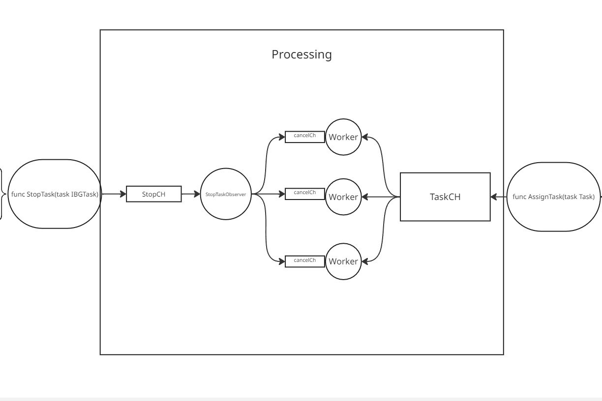

# Тестовое задание для WorkMate

Сеервис для Создания/Исполнения/Удаления I/O Bound Задач

## Оглавление

*   [Как Запустить](#Как запустить)
*   [Документация ручек](#Документация ручек)
*   [Схема работы планировщика задач](#Cхема работы планировщика задач)

## Как запустить
go run main.go
## Документация ручек
Свагер находится: api/service/task/swagger/yml
## Cхема работы планировщика задач

